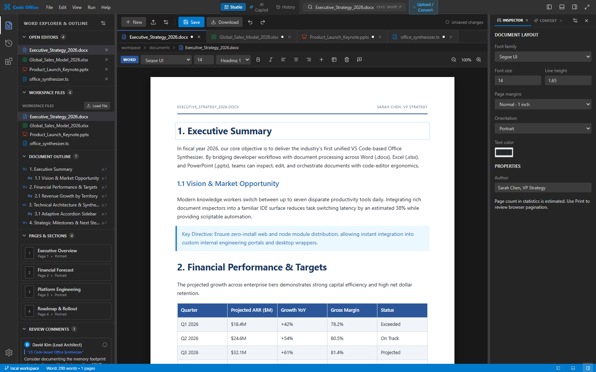
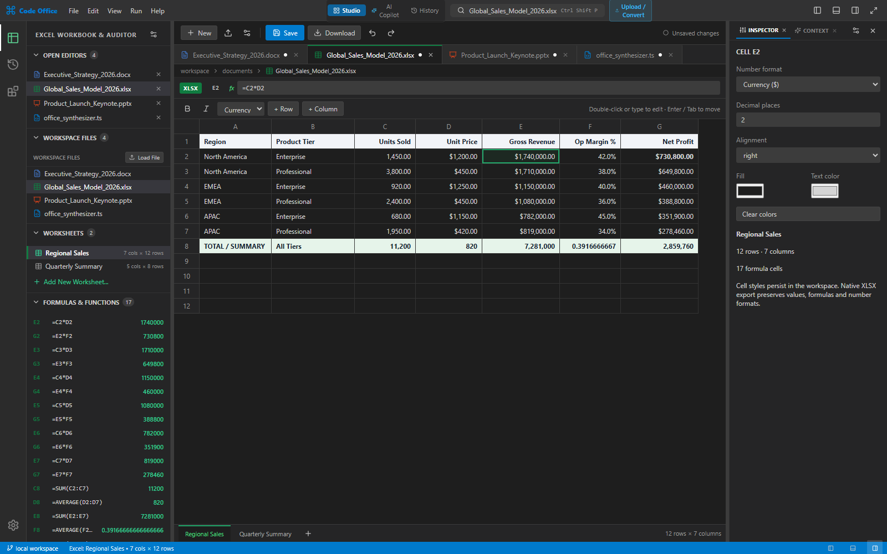
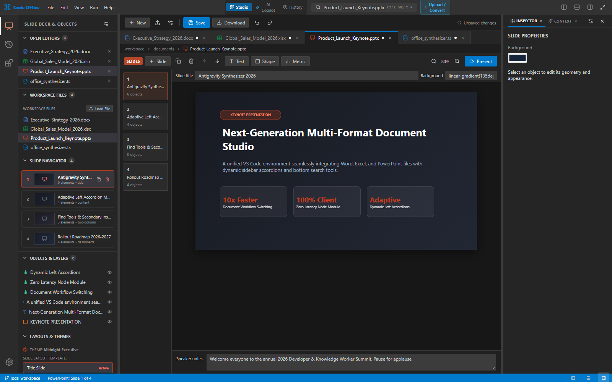
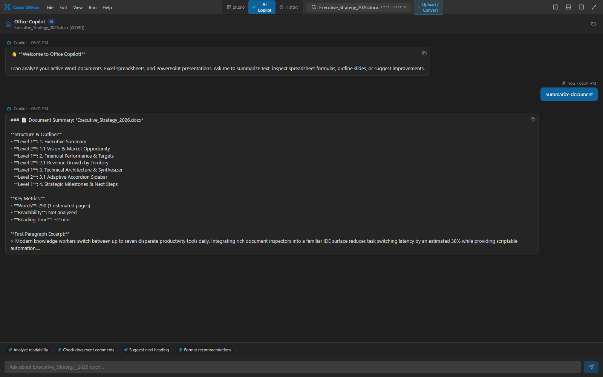

# Code Office Studio

A unified, production-grade Word, Excel, and PowerPoint document viewer, editor, and AI Copilot application built with React, TypeScript, and FastAPI (Python).

---

## Features

- **Document Studio**:
  - **Word Viewer & Editor**: Interactive typography, rich formatting, heading hierarchies, lists, callouts, and table rendering with real-time statistics (words, characters, reading time).
  - **Excel Spreadsheet Viewer & Editor**: Multi-sheet workbook grid with formulas, cell types, coordinate navigation, and cell Inspector.
  - **PowerPoint Slide Deck**: Interactive slide viewer and visual presenter with speaker notes, thumbnails, transitions, and deck properties.
  - **Code Editor**: Side-by-side programming editor with syntax modes.
- **AI Document Copilot (Chat)**:
  - Context-aware chat analyzing whichever document is currently open.
  - Quick action chips tailored per document type:
    - *Word*: Executive summary, readability & tone, grammar inspection.
    - *Excel*: Formula explanations, data anomalies, metric aggregations.
    - *PowerPoint*: Slide outline, speaker presentation script, flow critique.
  - Optional Gemini API integration via `GEMINI_API_KEY` with fallback to intelligent local semantic extraction.
- **Ingestion & History Ledger**:
  - Drag-and-drop file upload, file picker, and global `Ctrl+V` clipboard paste.
  - Automatic parsing of `.docx`, `.xlsx`, `.pptx`, `.pdf`, `.csv`, `.txt`, and `.md`.
  - Persistent SQLite conversion jobs ledger with status tracking, discard triggers (system temp file purge), and ZIP download capabilities.
- **Model Context Protocol (MCP)**:
  - Standard JSON-RPC 2.0 endpoint at `/mcp` exposing tools for document retrieval, creation, modification, and inspection.

---

## Screenshots

Captured from the running application using the bundled sample documents.

### Word document studio

Edit documents with an outline, review comments, and layout controls alongside the page.



### Excel workbook studio

Explore worksheets, inspect formulas, and format cells in the spreadsheet workspace.



### PowerPoint slide studio

Navigate slides, inspect objects, and edit speaker notes in the presentation workspace.



### Document Copilot

Ask questions about the active document. This example shows a summary produced by the built-in local assistant.



---

## Project Structure

```
.
├── original-project/    # Preserved original baseline project
├── backend/             # FastAPI Python backend
│   ├── app/
│   │   ├── main.py
│   │   ├── schemas/     # Pydantic schemas (document, chat, job)
│   │   ├── services/    # DocumentStore, JobStore, ChatService, ConversionPipeline, McpService
│   │   └── utils/       # TempManager (isolated system temp directory lifecycle)
│   ├── tests/           # Unit & integration tests
│   └── requirements.txt
├── frontend/            # React + TypeScript + Vite frontend
│   ├── src/
│   │   ├── components/  # Document viewers, DocumentChat, FileUploadModal, HistoryDashboard
│   │   ├── services/    # api.ts (FastAPI client)
│   │   └── App.tsx
│   └── package.json
├── e2e/                 # Playwright end-to-end automated tests
│   └── tests/studio.spec.ts
├── setup.py             # Cross-platform environment & dependency setup
├── setup.bat / setup.sh # Quick setup dispatchers
├── run.py               # Concurrent backend & frontend launcher with port negotiation
├── run.bat / run.sh     # Quick launch dispatchers
└── secrets.md           # Security & credential hygiene verification log
```

---

## Quick Start

### 1. Setup Environment

Run the setup script for your operating system:

- **Windows**:
  ```cmd
  setup.bat
  ```
- **macOS / Linux**:
  ```bash
  chmod +x setup.sh run.sh
  ./setup.sh
  ```

This will:
1. Verify Python 3.10+ and Node.js 18+.
2. Create and activate a Python virtual environment (`.venv`).
3. Install backend dependencies from `backend/requirements.txt`.
4. Install frontend npm dependencies in `frontend/`.
5. Create `.env` from `.env.example` if not already present.

### 2. Launch Application

Start both the backend server and frontend development server concurrently:

- **Windows**:
  ```cmd
  run.bat
  ```
- **macOS / Linux**:
  ```bash
  ./run.sh
  ```

The application will be accessible at:
- **Frontend Studio UI**: `http://localhost:5173` (or next free port)
- **FastAPI Backend**: `http://127.0.0.1:8000` (or next free port)
- **Interactive API Docs (Swagger)**: `/docs` on the selected backend port

Choose the frontend and backend ports independently:

```cmd
run.bat --frontend-port 5200 --backend-port 8100
```

To access the application from other devices on your LAN, use:

```cmd
run_lan.bat --frontend-port 5200 --backend-port 8100
```

`run_lan.bat` forwards all arguments to `run.bat serve --lan`. You can also run
`run.bat serve --lan` directly, or `./run.sh serve --lan` on macOS / Linux.
Both servers bind to `0.0.0.0` in LAN mode. Open the frontend **Network** URL
printed by Vite (for example, `http://192.168.1.10:5200`) on the other device.
The frontend proxies API requests to the selected backend port automatically.

Without `--lan`, the frontend binds to loopback and the backend uses
`BACKEND_HOST` (default `127.0.0.1`). LAN mode overrides `BACKEND_HOST`; an
explicit `--host` overrides the backend address in either mode.
Port flags take precedence over `FRONTEND_PORT` and `BACKEND_PORT` in `.env`.
Ports must be between 1 and 65535; if a requested port is busy or both ports are
the same, the launcher selects the next free port and prints the actual URLs.

---

## Testing

### Launcher Tests
```cmd
.venv\Scripts\python.exe -m unittest discover -s tests
```

### Backend Unit & Integration Tests
```cmd
.venv\Scripts\python.exe -m unittest discover backend/tests
```
*(On Unix: `./.venv/bin/python -m unittest discover backend/tests`)*

### Frontend Typecheck & Build
```cmd
cd frontend
npm run typecheck
npm run build
```

### End-to-End Tests (Playwright)
```cmd
cd e2e
npx playwright test
```

---

## Configuration & Credentials

All configuration is managed via `.env`:
```env
BACKEND_PORT=8000
FRONTEND_PORT=5173
BACKEND_HOST=127.0.0.1
GEMINI_API_KEY=your_optional_gemini_api_key_here
STORAGE_PATH=./data
MCP_ENABLED=true
```
*Note: If no `GEMINI_API_KEY` is provided, the AI Copilot operates using the built-in heuristic document intelligence engine without requiring external network access.*
