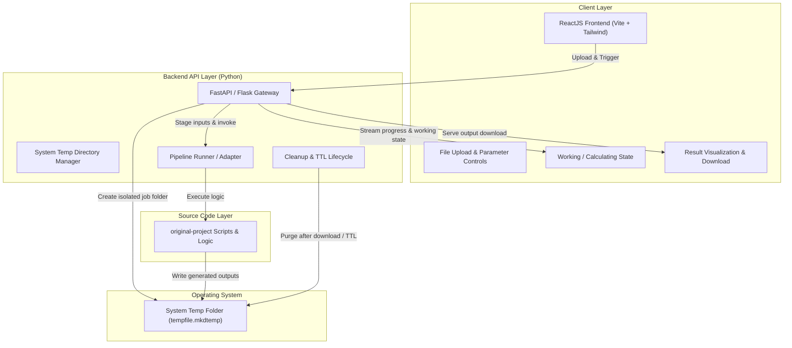
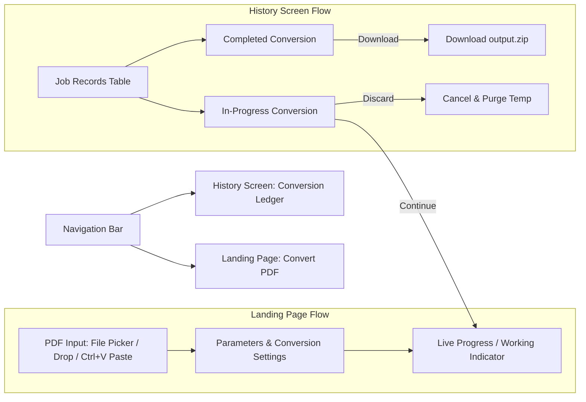

# Project Productionization Standard

This skill establishes the engineering blueprint and procedures for taking any prototype, script, or model from `original-project` and productionizing it into a maintainable, secure, and user-friendly full-stack application.



---

## Pillar 1: Architecture & Project Topology

A productionized repository isolates the user interface, backend service, legacy logic, and automation scripts into a clean, predictable topology.

### 1. Standard Directory Layout

```text
repository-root/
├── original-project/          # Original scripts, data fixtures, and legacy code (preserved)
├── backend/                   # Python backend API application
│   ├── app/
│   │   ├── __init__.py
│   │   ├── main.py            # FastAPI / API entrypoint and route declarations
│   │   ├── config.py          # Environment settings (Pydantic / os.environ)
│   │   ├── services/          # Adapter layer wrapping original-project scripts
│   │   │   ├── __init__.py
│   │   │   └── pipeline.py    # Execution pipeline and script invocation logic
│   │   ├── utils/
│   │   │   ├── __init__.py
│   │   │   └── temp_manager.py# System temp directory lifecycle & file piping
│   │   └── schemas/           # Pydantic request / response schemas
│   │       ├── __init__.py
│   │       └── job.py
│   ├── requirements.txt       # Backend dependencies (fastapi, uvicorn, pydantic, etc.)
│   └── tests/                 # Backend unit & integration tests
├── frontend/                  # ReactJS Web UI (Vite-based SPA)
│   ├── index.html
│   ├── package.json
│   ├── vite.config.js
│   ├── src/
│   │   ├── main.jsx
│   │   ├── App.jsx
│   │   ├── components/        # Upload dropzone, calculation monitor, result viewer
│   │   │   ├── FileUpload.jsx
│   │   │   ├── JobStatus.jsx
│   │   │   ├── ResultsPanel.jsx
│   │   │   └── LogViewer.jsx
│   │   └── services/
│   │       └── api.js         # API client (Axios / Fetch)
│   └── public/
├── setup.py                   # Python-based cross-platform setup orchestrator
├── setup.bat                  # Windows setup launcher (invokes setup.py)
├── setup.sh                   # Unix/macOS setup launcher (invokes setup.py)
├── run.bat                    # Windows runner (launches frontend + backend concurrently)
├── run.sh                     # Unix/macOS runner (launches frontend + backend concurrently)
├── secrets.md                 # Secret scan audit trail (never contains secret values)
├── .env.example               # Non-sensitive environment variable template
└── .gitignore                 # Repository ignore rules (excludes venvs, temp, .env)
```

### 2. Preserving and Adapting `original-project`

1. **Do Not Destroy Legacy Code**: Keep the original implementation intact inside `original-project/` to serve as a ground truth baseline.
2. **Adapter Layer**: The `backend/app/services/` layer should import functions directly from `original-project` or call the scripts via modular interfaces.
3. **Refactor for Non-Interactive Execution**: If original scripts used hardcoded paths or interactive `input()` calls, adapt them through parameterized functions or CLI argument flags while preserving computational correctness.

---

---

## Pillar 2: ReactJS Frontend UI, PDF Ingestion & History Dashboard

The user interface must provide a modern, responsive, and intuitive web experience built in ReactJS (using Vite for fast tooling and Tailwind or clean CSS for styling).

### 1. Application Layout & Screen Navigation

The frontend features a top navigation bar enabling seamless transitions between two primary screens:

1. **Converter Landing Page (`/` or "Convert" tab)**:
   - Primary user interaction hub for uploading, pasting, and configuring conversions.
   - Active conversion progress monitor with live status updates.
2. **Historical Conversions Screen (`/history` or "History" tab)**:
   - Persistent ledger of all past and current conversions.
   - Real-time display of in-progress conversions with **Continue** and **Discard** actions.
   - Direct **Download ZIP** triggers for all completed conversions.



### 2. PDF Ingestion: Selection, Drag-and-Drop & Clipboard Paste (`Ctrl+V`)

The UI must support three intuitive input modes:
- **File Picker**: Native file selection dialog constrained to `.pdf` documents (`accept=".pdf"`).
- **Drag-and-Drop Dropzone**: Visual highlight and validation when dropping files over the dropzone.
- **Clipboard Paste (`Ctrl+V`)**:
  - Window-level or dropzone paste event listener intercepting `clipboardData`.
  - Automatically detects PDF file blobs or binary clipboard content.
  - Automatically loads pasted PDFs into the staging queue with preview and file metadata.

```jsx
// Example Clipboard Paste Listener implementation
useEffect(() => {
  const handlePaste = (e) => {
    const items = e.clipboardData?.items;
    if (!items) return;
    for (let i = 0; i < items.length; i++) {
      if (items[i].kind === 'file' && items[i].type === 'application/pdf') {
        const pastedFile = items[i].getAsFile();
        if (pastedFile) {
          handleFileSelected(pastedFile);
          break;
        }
      }
    }
  };
  window.addEventListener('paste', handlePaste);
  return () => window.removeEventListener('paste', handlePaste);
}, []);
```

### 3. "Working" & Calculation State Management

- Explicit state transitions: `idle` → `uploading` → `working/converting` → `completed` (or `failed`).
- Visual indicators: animated circular spinner or multi-stage progress bar (e.g., "1. Staging PDF", "2. Extracting Text & Metadata", "3. Packaging Output ZIP").
- Real-time feedback with collapsible log viewer displaying stdout/stderr from backend execution.

### 4. Historical Conversions Screen

The Historical Conversions screen provides complete observability over all jobs:
- **Historical Table Columns**: Job ID, Filename, File Size, Created At, Elapsed Time, Status Badge.
- **In-Progress Conversions**:
  - Displayed prominently with an animated pulse/spinner badge.
  - **Continue Action**: Reconnects the user to the active job monitoring view on the landing page, restoring real-time progress and logs.
  - **Discard Action**: Sends `POST /api/jobs/{job_id}/discard` to immediately terminate the backend process, delete the job's temporary directory under the system temp folder, and mark the job as `discarded`.
- **Completed Conversions**:
  - **Download ZIP Action**: Initiates immediate download of the consolidated `.zip` archive containing all extracted text, converted markdown, tables, images, and logs.
- **Auto-Refresh**: Polls the `/api/jobs` endpoint every 3–5 seconds so status updates reflect automatically without manual page reloads.

### 5. Frontend Component Contract Example

```jsx
import React, { useState, useEffect } from 'react';
import { getJobs, discardJob, downloadZipUrl } from '../services/api';

export function ConversionHistory({ onContinueJob }) {
  const [jobs, setJobs] = useState([]);
  const [loading, setLoading] = useState(true);

  const loadJobs = async () => {
    try {
      const data = await getJobs();
      setJobs(data);
    } finally {
      setLoading(false);
    }
  };

  useEffect(() => {
    loadJobs();
    const timer = setInterval(loadJobs, 4000);
    return () => clearInterval(timer);
  }, []);

  const handleDiscard = async (jobId) => {
    if (!window.confirm('Are you sure you want to discard this in-progress conversion?')) return;
    await discardJob(jobId);
    loadJobs();
  };

  return (
    <div className="history-screen">
      <h2>Conversion History</h2>
      {loading ? <p>Loading history...</p> : (
        <table className="jobs-table">
          <thead>
            <tr>
              <th>Filename</th>
              <th>Status</th>
              <th>Created</th>
              <th>Actions</th>
            </tr>
          </thead>
          <tbody>
            {jobs.map((job) => (
              <tr key={job.id} className={`status-${job.status}`}>
                <td>{job.filename}</td>
                <td><span className={`badge badge-${job.status}`}>{job.status}</span></td>
                <td>{new Date(job.created_at).toLocaleTimeString()}</td>
                <td>
                  {job.status === 'in_progress' && (
                    <div className="btn-group">
                      <button className="btn-continue" onClick={() => onContinueJob(job.id)}>
                        Continue
                      </button>
                      <button className="btn-discard" onClick={() => handleDiscard(job.id)}>
                        Discard
                      </button>
                    </div>
                  )}
                  {job.status === 'completed' && (
                    <a className="btn-download" href={downloadZipUrl(job.id)} download>
                      Download ZIP
                    </a>
                  )}
                  {(job.status === 'failed' || job.status === 'discarded') && (
                    <span className="text-muted">{job.status}</span>
                  )}
                </td>
              </tr>
            ))}
          </tbody>
        </table>
      )}
    </div>
  );
}
```

---

## Pillar 3: Python Backend, Temp Pipeline & ZIP Packaging

The backend coordinates file staging in the operating system temp folder, script execution, persistent history tracking, and archive packaging.

### 1. Isolated System Temp Folder Protocol

To guarantee safe, concurrent, and thread-safe processing, **every conversion must execute inside an isolated folder created under the system's temporary directory**:

- **Location**: Use Python's standard `tempfile.gettempdir() / "prod_jobs" / <job_uuid>` or `tempfile.mkdtemp(prefix="prod_job_")`.
- **Directory Layout Per Job**:
  ```text
  <system-temp-dir>/prod_jobs/<job_uuid>/
  ├── inputs/
  │   └── document.pdf          # Staged user upload or pasted PDF
  ├── work/
  │   └── page_001.raw          # Intermediate extraction files
  ├── outputs/
  │   ├── extracted_text.txt    # Converted text output
  │   ├── content.md            # Converted markdown document
  │   └── metadata.json         # Extracted document metadata
  └── archive/
      └── conversion_output.zip # Consolidated output zip file
  ```
- **Zero Repository Pollution**: Never write uploaded files, scratch buffers, or generated outputs into the repository workspace.

### 2. Piping PDF Files Through `original-project`

1. **Stage PDF**: Write the incoming `UploadFile` stream directly into `<job_dir>/inputs/input.pdf`.
2. **Invoke Conversion**:
   - Call the adapted functions or invoke the script from `original-project` with explicit CLI paths:
     ```python
     cmd = [
         sys.executable,
         str(script_path),
         "--input", str(job_dir / "inputs" / "input.pdf"),
         "--output-dir", str(job_dir / "outputs"),
     ]
     proc = subprocess.Popen(cmd, stdout=subprocess.PIPE, stderr=subprocess.PIPE, text=True)
     ```
3. **Packaging the ZIP Archive**:
   - When conversion finishes successfully, package all files in `<job_dir>/outputs/` into `<job_dir>/archive/conversion_output.zip` using Python's `zipfile` module:
     ```python
     import zipfile
     
     def package_outputs_to_zip(job_dir: Path) -> Path:
         outputs_dir = job_dir / "outputs"
         archive_dir = job_dir / "archive"
         archive_dir.mkdir(parents=True, exist_ok=True)
         zip_path = archive_dir / "conversion_output.zip"
         with zipfile.ZipFile(zip_path, "w", zipfile.ZIP_DEFLATED) as zf:
             for file in outputs_dir.rglob("*"):
                 if file.is_file():
                     zf.write(file, arcname=file.relative_to(outputs_dir))
         return zip_path
     ```

### 3. Job State Machine & Persistence

Maintain a persistent record of all jobs using a local SQLite database (`jobs.db`) or file-based registry:

- **States**: `queued` → `in_progress` → `completed` | `failed` | `discarded`
- **Schema Fields**:
  - `id` (UUID string)
  - `filename` (Original uploaded/pasted filename)
  - `file_size` (Bytes)
  - `status` (Current state)
  - `progress` (Integer percentage 0–100)
  - `created_at` (Timestamp)
  - `completed_at` (Timestamp, nullable)
  - `error_message` (Text, nullable)
  - `temp_dir` (Path to system temp folder)
  - `zip_path` (Path to generated zip file)

### 4. API Endpoint Contracts

```python
from fastapi import FastAPI, UploadFile, File, BackgroundTasks, HTTPException
from fastapi.responses import FileResponse
import tempfile, shutil, uuid
from pathlib import Path

app = FastAPI(title="Productionized Conversion API")

@app.post("/api/convert")
async def start_conversion(file: UploadFile = File(...), background_tasks: BackgroundTasks = None):
    job_id = str(uuid.uuid4())
    job_dir = Path(tempfile.gettempdir()) / "prod_jobs" / job_id
    inputs_dir = job_dir / "inputs"
    inputs_dir.mkdir(parents=True, exist_ok=True)
    
    input_path = inputs_dir / (file.filename or "pasted_document.pdf")
    with open(input_path, "wb") as f:
        shutil.copyfileobj(file.file, f)
        
    db_create_job(job_id=job_id, filename=file.filename, temp_dir=str(job_dir))
    background_tasks.add_task(run_conversion_pipeline, job_id, job_dir, input_path)
    return {"job_id": job_id, "status": "in_progress"}

@app.get("/api/jobs")
async def list_jobs():
    return db_get_all_jobs()

@app.get("/api/jobs/{job_id}")
async def get_job(job_id: str):
    job = db_get_job(job_id)
    if not job:
        raise HTTPException(status_code=404, detail="Job not found")
    return job

@app.post("/api/jobs/{job_id}/discard")
async def discard_job(job_id: str):
    job = db_get_job(job_id)
    if not job:
        raise HTTPException(status_code=404, detail="Job not found")
    
    # Terminate running process if active
    terminate_active_job_process(job_id)
    
    # Purge isolated system temp folder
    job_dir = Path(job["temp_dir"])
    if job_dir.is_dir():
        shutil.rmtree(job_dir, ignore_errors=True)
        
    db_update_job_status(job_id, "discarded")
    return {"job_id": job_id, "status": "discarded", "detail": "Temporary folder purged"}

@app.get("/api/jobs/{job_id}/download-zip")
async def download_zip(job_id: str):
    job = db_get_job(job_id)
    if not job or job["status"] != "completed":
        raise HTTPException(status_code=400, detail="Job is not completed")
    
    zip_path = Path(job["zip_path"])
    if not zip_path.is_file():
        raise HTTPException(status_code=404, detail="ZIP archive not found")
        
    return FileResponse(
        path=zip_path,
        filename=f"{Path(job['filename']).stem}_converted.zip",
        media_type="application/zip"
    )
```

---

---

## Pillar 4: Automated Setup & Dependency Management (`setup.py`, `setup.bat`, `setup.sh`)

Setting up the project must be fully automated across operating systems through dedicated setup scripts that delegate to `setup.py`.

### 1. `setup.py` Orchestrator

`setup.py` provides cross-platform environment provisioning:
- Validates Python version (>= 3.10) and Node.js / npm installation.
- Creates a Python virtual environment (`.venv`).
- Upgrades `pip` inside `.venv`.
- Installs backend dependencies from `backend/requirements.txt`.
- Installs frontend dependencies via `npm install` inside `frontend/`.
- Initializes `.env` from `.env.example` if not already present.

```python
#!/usr/bin/env python3
"""Cross-platform automated setup script."""

import os
import sys
import subprocess
import shutil
from pathlib import Path

ROOT_DIR = Path(__file__).resolve().parent
BACKEND_DIR = ROOT_DIR / "backend"
FRONTEND_DIR = ROOT_DIR / "frontend"
VENV_DIR = ROOT_DIR / ".venv"

def log(msg):
    print(f"\n[SETUP] {msg}")

def check_prerequisites():
    log("Checking prerequisites...")
    if sys.version_info < (3, 10):
        sys.exit("Error: Python 3.10 or higher is required.")
    if not shutil.which("npm"):
        sys.exit("Error: Node.js and npm are required. Please install Node.js.")

def create_virtualenv():
    log(f"Configuring Python virtual environment at {VENV_DIR}...")
    if not VENV_DIR.exists():
        import venv
        venv.create(VENV_DIR, with_pip=True)
    
    # Determine platform-specific python and pip executables
    if os.name == "nt":
        py_bin = VENV_DIR / "Scripts" / "python.exe"
        pip_bin = VENV_DIR / "Scripts" / "pip.exe"
    else:
        py_bin = VENV_DIR / "bin" / "python"
        pip_bin = VENV_DIR / "bin" / "pip"
    return py_bin, pip_bin

def install_backend(pip_bin):
    log("Installing backend dependencies...")
    subprocess.check_call([str(pip_bin), "install", "--upgrade", "pip"])
    req_file = BACKEND_DIR / "requirements.txt"
    if req_file.exists():
        subprocess.check_call([str(pip_bin), "install", "-r", str(req_file)])

def install_frontend():
    log("Installing frontend dependencies...")
    npm_cmd = "npm.cmd" if os.name == "nt" else "npm"
    subprocess.check_call([npm_cmd, "install"], cwd=str(FRONTEND_DIR))

def setup_env():
    log("Setting up environment configuration...")
    env_example = ROOT_DIR / ".env.example"
    env_target = ROOT_DIR / ".env"
    if env_example.exists() and not env_target.exists():
        shutil.copy(env_example, env_target)
        print("Created .env from .env.example")

def main():
    check_prerequisites()
    _, pip_bin = create_virtualenv()
    install_backend(pip_bin)
    install_frontend()
    setup_env()
    log("Setup completed successfully! Use run.bat (Windows) or ./run.sh (Unix) to start.")

if __name__ == "__main__":
    main()
```

### 2. `setup.bat` (Windows Entrypoint)

Dispatches `setup.py` using system Python:

```cmd
@echo off
setlocal
cd /d "%~dp0"

echo [SETUP.BAT] Checking Python installation...
python --version >nul 2>&1
if %errorlevel% neq 0 (
    echo Error: Python is not installed or not in PATH.
    pause
    exit /b 1
)

echo [SETUP.BAT] Dispatching setup.py...
python setup.py
if %errorlevel% neq 0 (
    echo Error: Setup failed.
    pause
    exit /b %errorlevel%
)

echo [SETUP.BAT] Setup complete.
pause
```

### 3. `setup.sh` (POSIX / Linux / macOS Entrypoint)

```bash
#!/usr/bin/env bash
set -e

cd "$(dirname "$0")"

echo "[SETUP.SH] Checking Python 3..."
if ! command -v python3 &> /dev/null; then
    echo "Error: python3 is not installed or not in PATH."
    exit 1
fi

echo "[SETUP.SH] Dispatching setup.py..."
python3 setup.py
echo "[SETUP.SH] Setup complete."
```

Ensure execute permissions are granted (`chmod +x setup.sh`).

---

## Pillar 5: Unified Process Orchestration (`run.bat`, `run.sh`)

A single command must launch both the frontend and backend services concurrently with clean process management and graceful shutdown.

### 1. `run.bat` (Windows)

```cmd
@echo off
setlocal
cd /d "%~dp0"

if not exist ".venv\Scripts\activate.bat" (
    echo [RUN.BAT] Virtual environment not found. Running setup.bat first...
    call setup.bat
)

echo ========================================================
echo Starting Project Full-Stack Services
echo Backend:  http://localhost:8000 (API & Docs: /docs)
echo Frontend: http://localhost:5173
echo ========================================================

:: Start backend in a separate terminal window or background process
start "Backend API Server" cmd /k "call .venv\Scripts\activate.bat && cd backend && uvicorn app.main:app --reload --host 0.0.0.0 --port 8000"

:: Start frontend in this terminal window
cd frontend
call npm run dev

echo [RUN.BAT] Shutting down...
```

### 2. `run.sh` (POSIX / Linux / macOS)

```bash
#!/usr/bin/env bash
set -e

cd "$(dirname "$0")"

if [ ! -f ".venv/bin/activate" ]; then
    echo "[RUN.SH] Virtual environment not found. Running setup.sh first..."
    ./setup.sh
fi

source .venv/bin/activate

echo "========================================================"
echo "Starting Project Full-Stack Services"
echo "Backend:  http://localhost:8000 (API & Docs: /docs)"
echo "Frontend: http://localhost:5173"
echo "========================================================"

# Graceful cleanup on SIGINT / SIGTERM / EXIT
cleanup() {
    echo -e "\n[RUN.SH] Stopping background services..."
    kill $(jobs -p) 2>/dev/null || true
    wait 2>/dev/null || true
    echo "[RUN.SH] All services stopped."
}
trap cleanup SIGINT SIGTERM EXIT

# Start backend in background
(cd backend && uvicorn app.main:app --reload --host 0.0.0.0 --port 8000) &
BACKEND_PID=$!

# Start frontend in foreground
(cd frontend && npm run dev) &
FRONTEND_PID=$!

# Wait for processes
wait
```

Ensure execute permissions are granted (`chmod +x run.sh`).

---

## Pillar 6: Secrets Detection, Redaction & Credential Hygiene

Before a repository is considered production-ready, scan the entire project for accidentally committed credentials, tokens, passwords, private keys, connection strings, and other sensitive configuration.

### 1. Repository-Wide Secret Scan

Recursively inspect source files, configuration files, scripts, documentation, CI/CD workflows, examples, test fixtures, and generated text files for likely secrets.

Common patterns include:

- API keys and access tokens
- OAuth client secrets
- GitHub/GitLab personal access tokens
- OpenAI, Anthropic, OpenRouter, AWS, Azure, Google Cloud, or other service credentials
- Database usernames and passwords
- Database connection strings
- SMTP credentials
- JWT signing secrets
- Private SSH keys
- PEM/private certificate material
- Webhook secrets
- `.env` files
- Hard-coded passwords
- Authorization headers
- Cloud access keys
- Session tokens and cookies

Where practical, supplement pattern matching with established secret-scanning tools such as:

```sh
gitleaks
trufflehog
detect-secrets
```

Do not depend exclusively on one scanner. Perform lightweight pattern-based checks as an additional safety layer.

### 2. Never Expose Detected Secrets

If a probable secret is found, **never reproduce its complete value in console output, reports, documentation, test output, or `secrets.md`.**

Bad:

```text
OPENAI_API_KEY=sk-proj-actual-secret-value
```

Good:

```text
OPENAI_API_KEY=<REDACTED_SECRET>
```

Logs may optionally include a very small non-sensitive fingerprint when required for identifying which credential was found, but the default behavior should be complete masking.

For example:

```text
sk-****REDACTED****
```

The original credential must never be copied into generated reports.

### 3. Automatically Mask Secrets in Repository Files

When a hard-coded secret is detected in a file, replace the secret with an appropriate safe placeholder whenever doing so will not corrupt a binary file or otherwise damage the project.

Examples:

```python
OPENAI_API_KEY = "<REDACTED_SECRET>"
```

```yaml
api_key: "<REDACTED_SECRET>"
```

```env
OPENAI_API_KEY=<REDACTED_SECRET>
```

Where environment-variable configuration is appropriate, prefer converting hard-coded credentials to runtime configuration:

```python
import os

OPENAI_API_KEY = os.environ.get("OPENAI_API_KEY")
```

Do not invent replacement credentials.

Do not mask ordinary identifiers, public URLs, version numbers, hashes, example values, or configuration merely because they resemble a secret. Secret detection should be conservative enough to minimize destructive false positives.

### 4. Record Findings in `secrets.md`

Create or update a repository-root file:

```text
secrets.md
```

The file records **where secrets were detected and what remediation occurred**, but never contains the secret itself.

Recommended format:

```markdown
# Secrets Audit

This file records potential secrets detected during repository
productionalization.

No secret values are stored in this report.

| File | Line | Secret Type | Action | Status |
|---|---:|---|---|---|
| `src/config.py` | 18 | API key | Replaced with environment variable | Remediated |
| `.github/workflows/build.yml` | 42 | Access token | Replaced with GitHub secret reference | Remediated |
| `examples/example.env` | 5 | Password | Replaced with placeholder | Remediated |
```

If the exact line number cannot reliably be determined, log the file location without inventing one:

```markdown
| File | Line | Secret Type | Action | Status |
|---|---:|---|---|---|
| `legacy/settings.conf` | — | Possible credential | Masked | Review recommended |
```

### 5. `secrets.md` Must Never Contain Secret Values

The following information may be recorded:

- Repository-relative file path
- Line number, when known
- General secret category
- Remediation performed
- Detection tool
- Review status
- Timestamp of the audit

The following information must **not** be recorded:

- Full secret value
- Full password
- Full private key
- Full API token
- Full authorization header
- Reversible encoding of the credential

The purpose of `secrets.md` is to provide an **audit trail of locations and remediation**, not an archive of credentials.

### 6. Protect Environment Configuration

Sensitive runtime values should normally be loaded from environment variables or the platform's secret-management facility.

For example:

```python
import os

api_key = os.environ["OPENAI_API_KEY"]
```

For GitHub Actions:

```yaml
env:
  OPENAI_API_KEY: ${{ secrets.OPENAI_API_KEY }}
```

Keep real environment files out of Git:

```gitignore
.env
.env.*
!.env.example
```

Provide `.env.example` when useful, containing only placeholders:

```env
OPENAI_API_KEY=
DATABASE_URL=
SERVICE_TOKEN=
```

### 7. Check Git History When Appropriate

Removing a credential from the current working tree does **not** remove it from previous Git commits.

If a real credential appears to have been committed:

1. Mask or remove it from the working tree.
2. Record its file location in `secrets.md`.
3. Mark the credential as requiring rotation.
4. Recommend revoking or rotating the affected credential immediately.
5. Check repository history for previous occurrences.
6. If necessary, use an appropriate history-rewriting procedure such as `git filter-repo`.

Never claim that masking the current file has made an exposed credential safe again.

Credential rotation is the authoritative remediation for an exposed live secret.

### 8. Secret-Safe CI/CD

CI workflows must avoid printing credentials into job logs.

Never use debugging commands that indiscriminately expose the environment, such as:

```sh
env
printenv
set
```

when secret-bearing environment variables may be present.

Ensure secret values are passed through the CI platform's protected secret mechanism and are not embedded directly in workflow YAML.

### 9. Secret Scanning Verification

Production verification should include a dedicated secret audit.

Example checks:

```sh
gitleaks detect --source . --no-banner
```

or equivalent tooling.

The verification process should confirm:

- No obvious plaintext credentials remain.
- `.env` and similar sensitive files are ignored.
- `.env.example` contains placeholders only.
- CI workflows reference secret stores rather than literal credentials.
- `secrets.md` exists after findings are discovered.
- `secrets.md` itself contains no secret values.
- Previously exposed credentials are clearly marked for rotation.

### 10. Safe Automation Rule

Automated productionalization agents must follow this sequence:

```text
SCAN
  ↓
CLASSIFY
  ↓
MASK / REFACTOR
  ↓
LOG LOCATION ONLY
  ↓
VERIFY
```

The agent must never:

```text
detect secret
    ↓
copy secret into secrets.md
```

Instead:

```text
detect secret
    ↓
mask secret
    ↓
record path + line + category + remediation
```

---

## Comprehensive Productionalization Checklist

When productionizing a project from `original-project`, execute and check off each step:

### Phase 1: Ingestion & Backend Pipeline
- [ ] **Preserve Original Code**: Keep `original-project/` files intact as reference.
- [ ] **Create Adapter Layer**: Write service functions in `backend/app/services/` that interface with `original-project` logic.
- [ ] **Isolate System Temp Directory**: Implement temp directory management using `tempfile.gettempdir()` / `tempfile.mkdtemp()` with unique job UUIDs for all uploads, intermediate files, and outputs.
- [ ] **Pipe Files Through Script**: Pass staged file paths and arguments directly to script logic without touching repository root.
- [ ] **ZIP Archive Generation**: Package all output files into a consolidated `.zip` archive inside the job's temp archive directory.
- [ ] **Job Persistence**: Maintain job state machine (`queued`, `in_progress`, `completed`, `failed`, `discarded`) in SQLite or registry.
- [ ] **Output Download Endpoint**: Provide `/api/jobs/{job_id}/download-zip` to stream the output archive.
- [ ] **Discard & Cleanup**: Provide `/api/jobs/{job_id}/discard` to abort in-progress jobs and purge temporary folders.

### Phase 2: ReactJS Frontend UI & History Screen
- [ ] **Landing Page & Navigation**: Implement top navigation linking the Landing Page ("Convert") and the Historical Conversions Dashboard ("History").
- [ ] **PDF Ingestion Modes**: Support native file selection, drag-and-drop, and **clipboard paste (`Ctrl+V`)** for PDF documents.
- [ ] **Active Calculation Feedback**: Display multi-stage progress bars, working spinners, and real-time execution logs.
- [ ] **Historical Conversions Screen**: Build dedicated screen showing persistent history of all past and current conversion jobs.
- [ ] **In-Progress Controls**: Provide **Continue** (reconnect monitor) and **Discard** (abort & purge temp) actions on in-progress jobs.
- [ ] **ZIP Download**: Provide one-click **Download ZIP** triggers for all completed conversions.
- [ ] **Error Handling**: Display clear error banners for failed jobs or invalid file formats.

### Phase 3: Setup & Run Automation
- [ ] **Cross-Platform Setup Script**: Author `setup.py` to create `.venv`, install backend dependencies, and run `npm install`.
- [ ] **Setup Launchers**: Create `setup.bat` (Windows) and `setup.sh` (POSIX) dispatching `setup.py`.
- [ ] **Unified Run Launchers**: Create `run.bat` (Windows) and `run.sh` (POSIX) dispatching frontend and backend concurrently with clean shutdown.

### Phase 4: Secrets Hygiene & Final Verification
- [ ] **Secrets Audit**: Recursively scan the repository for credentials, API keys, tokens, passwords, private keys, connection strings, `.env` files, and other sensitive material.
- [ ] **Secret Masking**: Replace confirmed hard-coded secrets with `<REDACTED_SECRET>`, environment-variable references, or the platform's secret-management mechanism.
- [ ] **Secrets Report**: Record affected repository-relative file locations and remediation status in `secrets.md` without recording secret values.
- [ ] **Environment Protection**: Ensure sensitive `.env` files and local credential files are excluded through `.gitignore`. Provide `.env.example`.
- [ ] **CI Secret Safety**: Ensure CI/CD workflows use protected secret stores and do not print secret-bearing environment variables.
- [ ] **History Review**: If a live secret may have been committed, flag it for credential rotation and check Git history.
- [ ] **Final Secret Verification**: Run a final scan and verify that neither the repository nor `secrets.md` exposes detected credentials.
- [ ] **End-to-End Test**: Verify running `setup.bat`/`setup.sh` and `run.bat`/`run.sh` launches the stack and processes a sample calculation end-to-end.